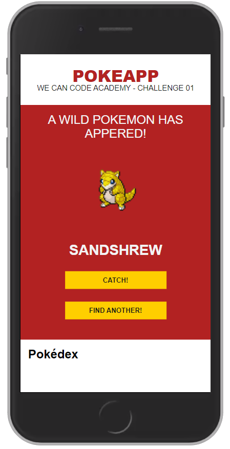

# Desafio 01
<p align="center">
    
</p>
Criar uma aplicação Web de um Pokedex usando React para consumir a [PokéAPi](https://pokeapi.co/) atendendo os seguintes requisitos:

- [x] Aplicativo criado com React (yarn create react-app pokeapp)
- [x] Usar a API [PokéAPi](https://pokeapi.co/)
- [ ] Um Pokémon não pode ser capturado mais de uma vez
- [ ] Um Pokémon só pode ser solto uma vez
- [ ] A busca deve ser feita a cada caractere digitado na barra de pesquisa
- [ ] Cada página deve contar de 20 ou 25 resultados
- [ ] Deve ter um indicador de que a página está carregando e/ou os elementos da página
- [ ] A lista com os Meus Pokémons devem ser exibidas mesmo se a página for atualizada
  
Sugestões de extras:
- [x] Função aleatória que nos faz encontrar um Pokémon
- [ ] Se não houver registro de usuário cadastrado, mostrar apenas a opção de cadastro de usuário
- [ ] Se houver usuário cadastrado, mostrar os usuários e o botão de cadastrar um novo usuário
- [ ] No perfil do usuário adicionar nome, avatar e número de Pokémons cadastrados, bem como listar os Pokémons capturados
- [x] Ao clicar em um dos Pokémons capturados há a opção de libertá-lo
- [ ] No perfil do usuário há a opção de buscar por outros Pokémons
- [ ] Na busca você clica no Pokémon e vê características dele, há também a opção de capturar

## Desenvolvedoras (Grupo 17)

[Andressa Amorin](https://github.com/amorimandy)

[Danielle Souza](https://github.com/DanielleSousa)

[Isabella Nunes](https://github.com/isabellanunes)

[Thais Minas](https://github.com/thaisminas)

## Como contribuir?

Faça o clone do repositório em sua máquina com o comando a seguir:

```shell
git clone git@github.com:isabellanunes/wcca2021-challenge01.git
```

Depois devemos definir um remote. Um remote é quando apontamos nosso projeto local para o projeto original no GitHub, de modo que possamos pegar as mudanças que forem feitas nele e adicioná-las dentro da nossa cópia local. Imagine que várias pessoas que trabalham no mesmo projeto sempre vão estar fazendo mudanças. Com o remote você pode depois usar o `git pull` para pegar essas mudanças que forem chegando no repositório.

```shell
git remote add upstream git@github.com:isabellanunes/wcca2021-challenge01.git
```

Agora definimos uma branch (ramificação) para chamar de nossa. Suponha que você irá adicionar alguma funcionalidade, ou algum arquivo, uma função, para qualquer modificação que será feita no projeto você deve criar um branch, o intuito é que uma vez que essa branch é validada, fazemos o processo de merge, que é quando as modificações feitas na sua branch são validadas e incorporadas ao projeto. Há algumas boas práticas para nomear suas branchs:

feature/nome-pequeno ➡️ Usamos essa estrutura para novas funcionalidades, onde nome-pequeno seria uma descrição para a feature

hotfix/nome-pequeno ➡️ Usamos essa estrutura para bugfixes, onde nome-pequeno seria uma descrição para a correção de bug

```shell
git checkout main
git pull upstream main
git push origin main
git checkout -b nome-da-sua-branch
```

Depois de fazer as codificações e adicionar tudo o que achar pertinente. É necessário mapear as mudanças feitas ao git usando o:

```
git add .
```

Após fazer o add é necessário realizar o commit, em sua branch você pode fazer vários commits, eles vão te ajudar a entender e controlar o fluxo de desenvolvimento. A cada mudança significativa é bom fazer um commit, de modo que se for necessário, você pode restaurar o seu código em um certo commit. Os fluxos do git vão ajudar a resolver aqueles problemas de quando um desenvolvedor faz uma mudança e o projeto para de funcionar. Basta restaurar o projeto para o commit que estava funcionando e continuar a codificação.

```
git commit -m "Pequena descrição do seu commit aqui"
```

Feito o commit é hora de consolidar as alterações e fazer um push (empurrar), a fim de literalmente "empurrar" as mudanças que vocês fez para o repositório lá no GitHub.

```
git push -u origin nome-da-branch
```

Feito o push o seu código já está no GitHub, mas ele ainda não faz parte do projeto. Para que ele seja incorporado ao projeto você precisa abrir um pull request. Esse processo é feito lá mesmo no GitHub, na página do projeto na opção pull request. Lá você deve escolher a sua branch, escrever uma descrição das modificações que fez e clicar no pull. O dono do repositório vai análisar o seu código, aprovar, rejeitar ou solicitar alguma mudança para a aprovação.

## Requisitos

NodeJS 14.15.4

## Como executar

Na pasta:

```
pokeapp
```

Executar:

```
yarn install
```

E depois:

```
yarn start
```

Acessar [http://localhost:3000](http://localhost:3000) para visualizar a aplicação no navegador.

## Referências

[Learn React Hooks with Pokémon](https://www.youtube.com/watch?v=LxOMWk7K0QE)

[How to Build a Simple Pokémon Web App with React Hooks and the Context API](https://www.freecodecamp.org/news/building-a-simple-pokemon-web-app-with-react-hooks-and-context-api/)